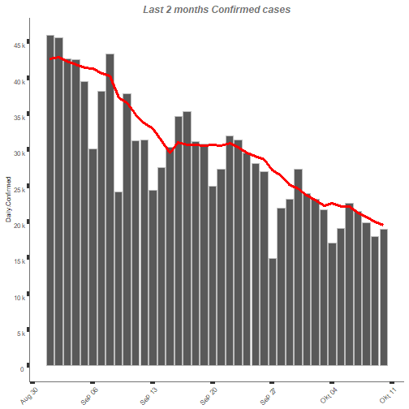
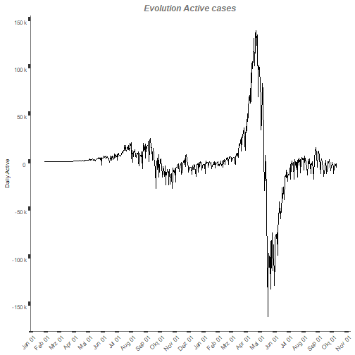

## `R` Markdown

This is an `R` Markdown document. Markdown is a simple formatting syntax for authoring `HTML`, `PDF`, and MS Word documents. For more details on using `R` Markdown see <http://rmarkdown.rstudio.com>.

When you click the **Knit** button a document will be generated that includes both content as well as the output of any embedded `R` code chunks within the document.


## Processing covid 19 data

In this section we read covid19 data from the package and we process them computing additional variables (actives and daily values) and rolled means.

Note that the `echo = TRUE` parameter was added to the code chunk to allow printing of the `R` code that generated the plot.


```r
> df <- read_data(filename = "case_time_series.csv",
+                path = "covid_data")
> data <- process_data(df)
> last_n_days_rep(data, 7)
```

```
  Confirmed Recovered Deceased  Active
1   119'952   142'591    1'522 -24'161
```
2 modules have been used: 

- `read_data` to read from csv file in a given folder
- `process_data` to compute some missing variables like daily values and Actives

These 2 modules could be used also with a different data-set that has however the same structure.

## Graphics

Let's analyse how the infections developed in the last 2 months:


```r
> bar_plot_data(data, value = "Daily.Confirmed", startdate = "2021-09-01", title = "Last 2 months Confirmed cases", rollm = TRUE)
```

<div class="figure" style="text-align: center">

<p class="caption">plot of chunk graph1</p>
</div>

Let's analyse how the active cases have developed in the last month:


```r
> line_plot_data(data, value = "Daily.Active", title = "Evolution Active cases")
```

<div class="figure" style="text-align: center">

<p class="caption">plot of chunk graph2</p>
</div>

2 graphic modules have been used: `line_plot_data` `bar_plot_data` which share smaller modules.

## Re-use module

`*_plot_data` functions would work with any data-set that has a "Date" column. 

For example this "Lakers" data-set from `lubridate` package contains a time series of scores from the Lakers`players.


```r
> tail(lakers_dt)
```

```
# A tibble: 6 × 17
# Groups:   Date [6]
  Date       Andrew_Bynum Chris_Mihm Derek_Fisher Jordan_Farmar Kobe_Bryant Lamar_Odom Pau_Gasol Sasha_Vujacic
  <date>            <int>      <int>        <int>         <int>       <int>      <int>     <int>         <int>
1 2009-04-05           NA         NA            3             9          18         18        14             3
2 2009-04-07           NA         NA            3             4          22         15        26            12
3 2009-04-09           16         NA            4             3          33          7        27             9
4 2009-04-10           13         NA            2            NA          32         17        12             5
5 2009-04-12           18         NA            4             2          16          8        12             9
6 2009-04-14           22         NA            5             5          16         16        20            15
# ℹ 8 more variables: Trevor_Ariza <int>, Vladimir_Radmanovic <int>, Josh_Powell <int>, Luke_Walton <int>,
#   Yue_Sun <int>, Adam_Morrison <int>, Shannon_Brown <int>, D.J._Mbenga <int>
```

```r
> bar_plot_data(lakers_dt, value = "Kobe_Bryant", title = "Lakers player points", rollm = FALSE)
```

<div class="figure" style="text-align: center">

<p class="caption">plot of chunk lakers 2</p>
</div>

